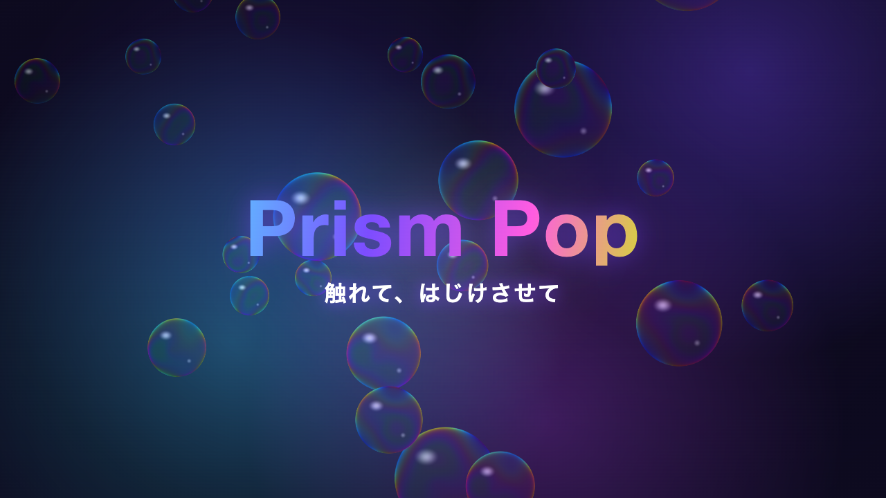
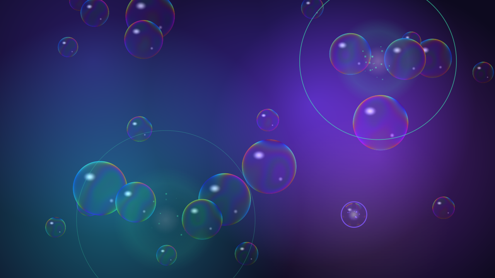

# Prism Pop



[日本語](#日本語) | [English](#english)

## 日本語

虹色の膜をまとった泡をタップ・なぞって割る、ブラウザで遊ぶインタラクティブアート。割るたびにベルとマリンバが F リディアンで鳴り、テンポよく割り続けると音が駆け上がって和音が積み上がる。



### 遊び方

- **タップ / クリック**: 泡を割る。大きい泡は低いマリンバ、小さい泡は高いベルが鳴る
- **なぞる**: 押したまま動かすと、通った泡をまとめて割る
- **マルチタッチ**: 複数の指で同時に割れる
- **コンボ**: 0.9 秒以内に次を割るとコンボが続き、音が上の音域へ上がっていく
- **プリズムバースト**: コンボが 8 の倍数に達するたびに虹色の輪が広がり、輪に触れた泡が連鎖して割れる

音は最初のタップで鳴り始める（ブラウザの自動再生制限のため）。

### 特徴

- 音声ファイルを使わず、ベル・マリンバ・破裂音・残響まで Web Audio API で合成
- 泡の膜は薄膜干渉（膜厚 220〜760nm・3 波長）とフレネル反射で描く
- 適応型画質: 2D 描画（standard）で起動し、端末に余裕があれば WebGL2 シェーダ（rich）へ自動で昇格。重くなれば自動で戻す
- スマホ・PC 両対応（Pointer Events でマウスとタッチを統一）

### 動かし方

必要なもの: Node.js 26（`web/.node-version`）、pnpm

```bash
git clone https://github.com/takunagai/prism-pop.git
cd prism-pop/web
pnpm install
pnpm dev       # 開発サーバー
pnpm build     # 型チェック → 本番ビルド（web/dist/）
pnpm preview   # ビルド結果の確認
```

開発用クエリ:

| クエリ | 効果 |
|---|---|
| `?mute` | 無音 |
| `?quality=standard` / `?quality=rich` | 画質を固定（自動判定しない） |
| `?debug` | 診断オーバーレイと `window.__prismDebug()` |

### 技術構成

- TypeScript 6 + Vite 8
- p5.js 2（インスタンスモード）─ 入力・描画ループ・しぶき粒子
- Web Audio API ─ 音源の合成・残響（生成 IR）・リミッタ
- WebGL2 ─ rich 画質の背景と泡（全画面フラグメントシェーダ）

### ドキュメント

| ファイル | 内容 |
|---|---|
| [docs/concept.md](docs/concept.md) | コンセプトシート（感情ゴール・操作・ビジュアル・音） |
| [docs/architecture.md](docs/architecture.md) | 設計の正本（モジュール構成・状態・音視覚マッピング・画質判定） |
| [docs/process-log.md](docs/process-log.md) | 制作記録（設計判断と見つけた不具合） |
| [web/README.md](web/README.md) | 視覚・操作・画質の調整ノブ一覧 |
| [web/src/audio/README-audio.md](web/src/audio/README-audio.md) | 音響の調整ノブ一覧 |

### ライセンス

[MIT](LICENSE) © 2026 ながたく (Taku Nagai) ─ [ナガイ商店.com](https://nagai-shouten.com/)

---

## English

An interactive art piece for the browser: tap or swipe to pop iridescent bubbles. Each pop rings a bell or marimba note in F Lydian, and popping in quick succession climbs the scale and stacks up chords.

### How to play

- **Tap / click** a bubble to pop it. Large bubbles play low marimba notes; small ones play high bells
- **Swipe** (drag while pressing) to pop every bubble along the path
- **Multi-touch** pops several bubbles at once
- **Combo**: pop the next bubble within 0.9 s to keep the combo going, and the notes climb higher
- **Prism burst**: each time the combo reaches a multiple of 8, a rainbow ring expands and pops the bubbles it touches in a chain

Sound starts on the first tap (browser autoplay policy).

### Features

- No audio files: bells, marimba, pop clicks, and reverb are all synthesized with the Web Audio API
- Bubble films are rendered with thin-film interference (220–760 nm thickness, 3 wavelengths) and Fresnel reflection
- Adaptive quality: starts with 2D rendering (standard) and upgrades to a WebGL2 shader (rich) when the device has headroom, then falls back automatically under load
- Works on phones and desktops (mouse and touch unified via Pointer Events)

### Getting started

Requirements: Node.js 26 (`web/.node-version`), pnpm

```bash
git clone https://github.com/takunagai/prism-pop.git
cd prism-pop/web
pnpm install
pnpm dev       # dev server
pnpm build     # type check, then production build (web/dist/)
pnpm preview   # preview the build
```

Dev query parameters:

| Query | Effect |
|---|---|
| `?mute` | No sound |
| `?quality=standard` / `?quality=rich` | Fix the quality tier (no auto detection) |
| `?debug` | Diagnostic overlay and `window.__prismDebug()` |

### Tech stack

- TypeScript 6 + Vite 8
- p5.js 2 (instance mode): input, draw loop, splash particles
- Web Audio API: sound synthesis, reverb (generated IR), limiter
- WebGL2: background and bubbles for the rich tier (full-screen fragment shader)

### Documentation

The design notes in `docs/` and the tuning tables in `web/README.md` are written in Japanese.

### License

[MIT](LICENSE) © 2026 Taku Nagai
